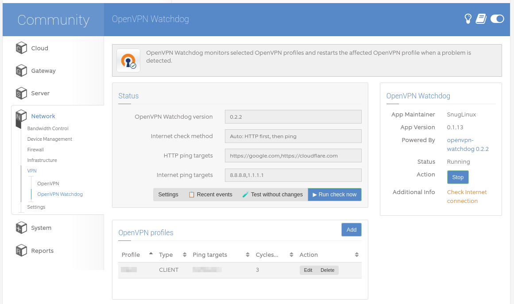

# app-openvpn-watchdog

ClearOS Webconfig app for configuring and controlling **openvpn-watchdog**.

## Screenshot



## Scope

The app is intentionally conservative:

- edits only `/etc/openvpn-watchdog.conf`;
- manages `OPENVPN_PROFILES` through Add/Edit/Delete buttons instead of forcing raw array editing;
- creates backups before saving configuration;
- controls only `openvpn-watchdog.timer` through a fixed privileged helper;
- can run `openvpn-watchdog --dry-run` from Webconfig;
- can run one immediate watchdog check from Webconfig;
- does not directly start/stop/restart arbitrary OpenVPN profile units;
- does not require changing ownership of `/etc/openvpn` from `openvpn:openvpn`;
- does not require adding the `webconfig` user to the `openvpn` group.

## What is new in 0.1.14

Version **0.1.14** fixes profile discovery and adds an OpenVPN permissions safety check.

### Profile discovery through the privileged helper

Older versions discovered profiles directly from PHP with paths like:

```php
glob('/etc/openvpn/client/*-client.conf')
```

That fails on ClearOS systems where Webconfig runs as `webconfig:webconfig` and OpenVPN files are correctly protected as `openvpn:openvpn`, for example:

```text
/etc/openvpn/client              openvpn:openvpn 0750
/etc/openvpn/client/*.conf       openvpn:openvpn 0640
```

The app now asks the fixed privileged helper for the safe profile list:

```bash
/usr/sbin/clearos-openvpn-watchdog-helper list-profiles
```

The helper returns only profile type/name pairs such as:

```text
CLIENT  office
SERVER  gateway
```

It does not expose OpenVPN config file contents, keys, certificates, passwords, or private settings to Webconfig.

### Unsafe OpenVPN permissions warning

Version 0.1.14 also adds a Webconfig warning when sensitive OpenVPN directories or files are accessible by `other`, for example `0755`, `0754`, `0744`, or `0644` on sensitive files.

The helper action is:

```bash
/usr/sbin/clearos-openvpn-watchdog-helper check-permissions
```

If unsafe permissions are found, the Webconfig summary page shows a warning and a **Fix OpenVPN permissions** button.

### Fix OpenVPN permissions button

The fix button calls:

```bash
/usr/sbin/clearos-openvpn-watchdog-helper fix-permissions
```

The helper changes only file modes. It does **not** change owners or groups.

The intended safe modes are:

```text
/etc/openvpn/client              0750
/etc/openvpn/server              0750
/etc/openvpn/client/key*         0750
/etc/openvpn/server/key*         0750
sensitive files                  0640
```

Sensitive files include:

```text
*.conf *.ovpn *.key *.pem *.crt *.p12 *.pfx *.pass pass
```

Scripts such as `client.up`, `client.down`, and `*-restart.sh` are intentionally not changed by the permission fixer.

## Files

```text
controllers/      ClearOS Webconfig controllers
views/            summary and settings pages
libraries/        OpenVPN Watchdog integration logic
deploy/           install script, app metadata and privileged helper
language/         translations
packaging/        RPM spec and local build helper
```

## Development install on ClearOS

```bash
sudo ./install-app-tree-dev.sh
```

Then open:

```text
/app/openvpn_watchdog
```

## Build RPM

```bash
./packaging/build-rpm.sh --nodeps
```

Install on ClearOS:

```bash
yum localinstall app-openvpn-watchdog-*.noarch.rpm
```

## Quick checks

After installing or upgrading, these commands should work:

```bash
/usr/sbin/clearos-openvpn-watchdog-helper list-profiles
/usr/sbin/clearos-openvpn-watchdog-helper check-permissions
sudo -u webconfig sudo -n /usr/sbin/clearos-openvpn-watchdog-helper list-profiles
```

If `check-permissions` prints nothing, no unsafe OpenVPN permissions were found.

## Important safety notes

The **Run Check Now** button can trigger the normal openvpn-watchdog logic. If the watchdog detects a broken OpenVPN profile, it may restart only that affected OpenVPN service.

Use **Dry Run** first when testing new configuration.
